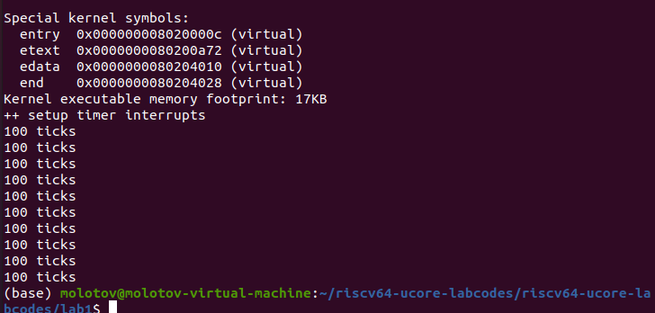

# 练习二
## 1.实现目标
+ 对时钟中断进行处理的部分填写kern/trap/trap.c函数中处理时钟中断的部分，使操作系统每遇到100次时钟中断后，调用print_ticks子程序，向屏幕上打印一行文字”100 ticks”，在打印完10行后调用sbi.h中的shut_down()函数关机。
## 2.实现过程
### 实现准备
+ trap.c文件中定义好了一个print_ticks函数，用来向屏幕上面打印一行文字"100 ticks"。
+ trap.c文件中定义了一个可改变值的变量num，并初始化其值为0，用来记录打印"100 ticks"的次数。
+ clock.c文件中定义好了一个可更改值的变量ticks作为计数器，并初始化赋予其值为0。
+ clock.c文件中定义了一个clock_set_next_event函数，里面用到了OpenSBI提供的sbi_set_timer()接口，给这个接口传入一个时刻，它可以在那个时刻触发一次时钟终端，这个接口传入的参数是get_cycles() + timebase。
  + get_cycles()是在clock.c中定义的一个函数，里面利用rdtime的伪指令读取了CPU启动之后经过的真实时间，因为无论在RISCV32还是RISCV64架构中，time寄存器都是64为，所以对于64位架构，只需要调用一次rdtime，但对于32位架构，就要把64的time寄存器读到两个32位的整数里，然后拼凑出来形成64位。
  + timebase是定义好的静态变量，其值为100000。
+ sbi.c文件中定义了sbi_shutdown函数，用来进行关机。
### 实现逻辑
+ clock.c文件的初始化函数中已经调用了一次clock_set_next_event函数，它就会跳转到时钟中断处理的代码处，但之后每次如果要发生时钟中断，还需要再次调用。所以我们首先再次调用clock_set_next_event函数。
+ 每调用一次时钟中断函数，我们让计数器的值增加1，当ticks的值为100的倍数时，也就是操作系统遇到了100次时钟中断，调用print_ticks函数，在屏幕上打印"100 ticks"，并使num的值加1。
+ 当num的值变为10后，也即向屏幕上打印了10次"100 ticks"后，调用sbi_shutdown()函数来关机。
## 3.实现结果
执行<strong>make qemu</strong>后，发现屏幕上打印了10条"100 ticks"，然后退出了qemu。

## 4.代码
具体代码已经上传到了gitee上面：<a href="https://gitee.com/dd1234_11/os-homework.git">点击打开仓库</a>
仓库链接：
```
https://gitee.com/dd1234_11/os-homework.git
```
